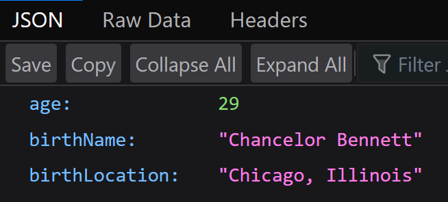

# Rap Names API
The rap name api allows users to find some information about their favorite rappers!

**Link to project:** [http://rapper-api-100devs-class39.herokuapp.com/](https://rapper-api-100devs-class39.herokuapp.com/)

## How It's Made:

**Tech used:** HTML, JavaScript, Node.js, Express

Rapper Names API allows users to access an API locally or over the web.

## Note:
Please make sure to run 'npm install'
node_modules is left out of the github repo to save space and for easier to use, this means you will have to install node modules before you can modify the server.

## Lessons Learned:

How to make APIs that can be used by users around the world! Node and Express allow an easy interface for users to access information using links! The backend is made easier to understand using Expresses unopioninated methods like sendFile or json!

## Examples:
https://rapper-api-100devs-class39.herokuapp.com/api/RAPPER_NAME
https://rapper-api-100devs-class39.herokuapp.com/api/chance the rapper
Returns information for Chance The Rapper

https://rapper-api-100devs-class39.herokuapp.com/api/21 savage
Returns information for 21 Savage
